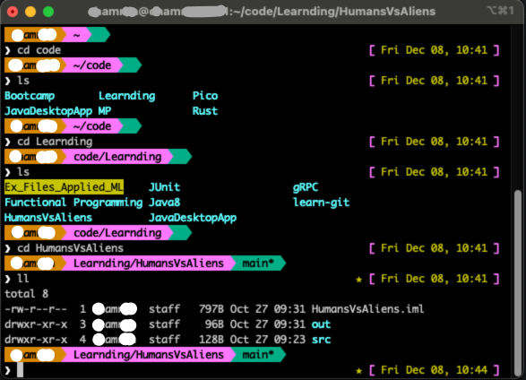

# spuwu
zsh Theme. 

Formatting based on example from [this](https://blog.carbonfive.com/writing-zsh-themes-a-quickref/#:~:text=Example%202%3A%20Informative%20shell) article
Time and date formatting based on [xiong-chiamiov](https://github.com/ohmyzsh/ohmyzsh/wiki/Themes#xiong-chiamiov) theme.

